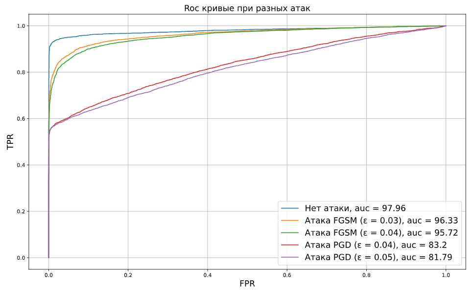
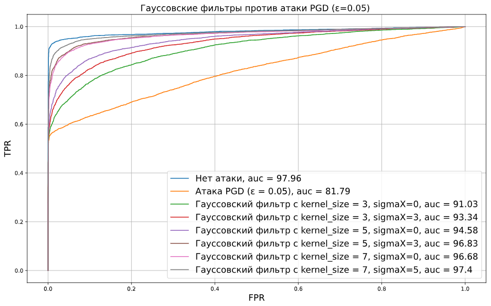
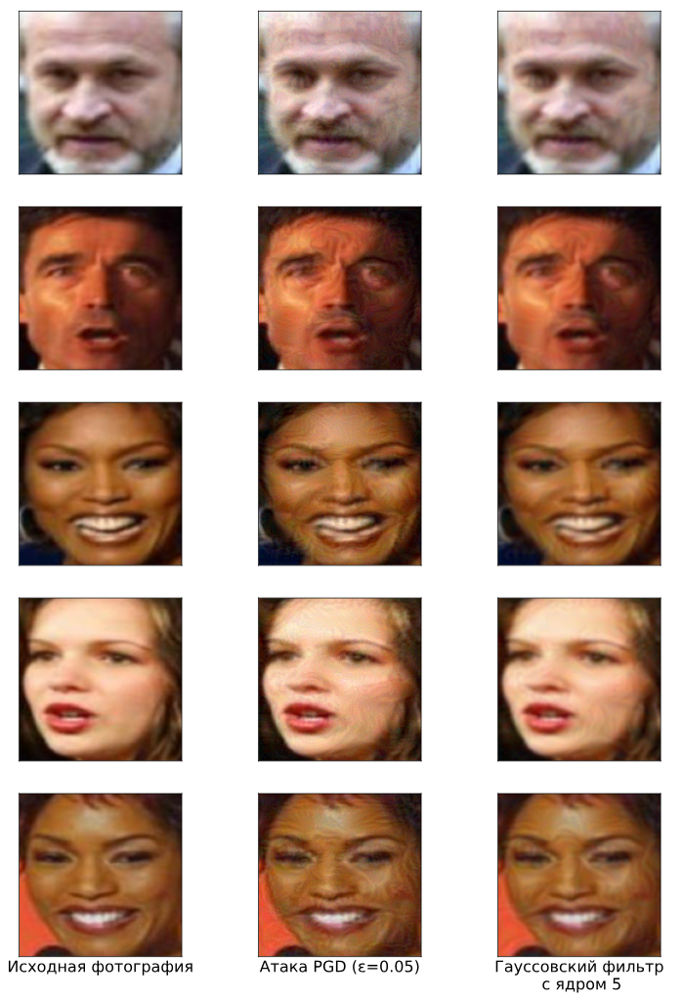

# Анализ устойчивости модели распознавания лиц к состязательным атакам и методы защиты (Протокол LFW)

Данный репозиторий содержит материалы, посвященной исследованию уязвимости нейросетевых моделей верификации лиц к состязательным атакам (adversarial attacks), а также оценке эффективности методов предварительной фильтрации изображений для нейтрализации этих атак.

## 📌 Суть работы

Основная цель работы — оценить устойчивость предобученной модели распознавания лиц к градиентным состязательным атакам различной интенсивности и протестировать легковесный метод защиты на основе размытия по Гауссу (Gaussian Blur).

**Ключевые этапы исследования:**
1. **Верификация лиц** с использованием глубокой сверточной нейросети на стандартном наборе данных по протоколу LFW.
2. **Генерация состязательных примеров** (adversarial examples) с помощью библиотек `foolbox` и `eagerpy`, чтобы исказить входные данные и вызвать ошибку классификации.
3. **Реализация защиты** путем применения гауссовских фильтров с различными параметрами для подавления высокочастотного состязательного шума.
4. **Сравнительный анализ** качества работы модели с помощью метрики AUC (Area Under ROC Curve) для всех сценариев.

---

## 🛠 Технологический стек и инструменты

* **Язык программирования:** Python
* **Фреймворк глубокого обучения:** PyTorch
* **Архитектура модели:** `InceptionResnetV1` (из библиотеки `facenet-pytorch`), предобученная на датасете `vggface2`.
* **Фреймворк для атак:** `Foolbox` (инструмент для создания состязательных примеров).
* **Ускорение вычислений:** FAISS (`faiss-gpu`) для эффективного поиска и работы с эмбеддингами, а также CUDA для инференса нейросети.
* **Метрики и визуализация:** `scikit-learn` (метрики ROC-AUC), `matplotlib`.

---

## 📊 Протокол тестирования (LFW)

Тестирование проводилось по стандартному протоколу **Labeled Faces in the Wild (LFW)**:
* Используется **6000 пар** изображений (половина — пары одного человека, половина — разных людей).
* Модель извлекает векторы признаков (эмбеддинги) для каждого изображения.
* Вычисляется расстояние (метрика сходства) между эмбеддингами в паре.
* Строится ROC-кривая и рассчитывается показатель **AUC** для оценки качества разделения на «своих» и «чужих».

---

## ⚔ Исследованные состязательные атаки

В работе были реализованы две популярные градиентные атаки типа «белый ящик» (White-Box attacks):
1. **FGSM (Fast Gradient Sign Method):** Одношаговая быстрая атака, добавляющая к изображению шум в направлении градиента функции потерь. Рассмотрены параметры возмущения $\epsilon = 0.03$ и $\epsilon = 0.04$.
2. **PGD (Projected Gradient Descent):** Итеративная и более мощная атака, выполняющая несколько мелких шагов градиентного спуска с проецированием результата обратно в допустимую $\epsilon$-окрестность. Рассмотрены параметры $\epsilon = 0.04$ и $\epsilon = 0.05$.

---

## 🛡 Метод защиты: Гауссовская фильтрация

Для нейтрализации вредоносного шума, привнесенного атакой PGD, на этапе предобработки изображений использовался **фильтр Гаусса** (`cv2.GaussianBlur`). Идея заключается в том, что состязательные аддитивные шумы часто представляют собой высокочастотные колебания пикселей, которые могут быть сглажены низкочастотным фильтром без критической потери геометрии лица.

В экспериментах варьировались:
* Размер ядра фильтра (`kernel_size`): `3x3`, `5x5`, `7x7`.
* Среднеквадратичное отклонение (`sigmaX`): `0`, `3`, `5`.

---

## 📈 Результаты экспериментов и визуализация

Качество верификации оценивалось по метрике **AUC (%)**. 

### 1. Влияние атак на исходную модель
* **Чистый датасет (Без атак):** **97.96%** (Базовый уровень модели)
* **Атака FGSM ($\epsilon = 0.03$):** **96.33%**
* **Атака FGSM ($\epsilon = 0.04$):** **95.72%**
* **Атака PGD ($\epsilon = 0.04$):** **83.20%**
* **Атака PGD ($\epsilon = 0.05$):** **81.79%** *(Наиболее разрушительная атака)*

#### ROC-кривые при различных состязательных атаках:

### 2. Эффективность защиты против сильнейшей атаки PGD ($\epsilon = 0.05$)
Применение гауссовского размытия к атакованным изображениям показало значительное восстановление метрик:
* Фильтр Гаусса ($kernel=3, \sigma_X=0$): **91.03%**
* Фильтр Гаусса ($kernel=3, \sigma_X=3$): **93.34%**
* Фильтр Гаусса ($kernel=5, \sigma_X=0$): **94.58%**
* Фильтр Гаусса ($kernel=5, \sigma_X=3$): **96.83%**
* Фильтр Гаусса ($kernel=7, \sigma_X=0$): **96.68%**
* **Фильтр Гаусса ($kernel=7, \sigma_X=5$):** **97.40%** 🚀

#### Эффективность фильтрации против атаки PGD:

#### Пример работы атаки и метода защиты на изображении из LFW

---

## 💡 Основные выводы работы

1. **Уязвимость к итеративным атакам:** Модель `InceptionResnetV1` обладает хорошей естественной точностью (почти 98%), но крайне уязвима к итеративной атаке PGD, которая снижает качество верификации до ~81.8%. Одношаговая атака FGSM оказывает значительно меньшее разрушительное воздействие.
2. **Эффективность фильтрации:** Гауссовская фильтрация доказала свою высокую эффективность в качестве метода защиты (Defense through Preprocessing). 
3. **Оптимальная конфигурация:** Увеличение размера ядра до `7` и параметра `sigmaX` до `5` позволило практически полностью нивелировать состязательный эффект атаки PGD, восстановив AUC с **81.79%** до **97.40%**, что почти идентично показателю на чистых данных (97.96%). Данный метод является вычислительно простым и не требует ресурсоемкого дообучения нейросети (Adversarial Training).
